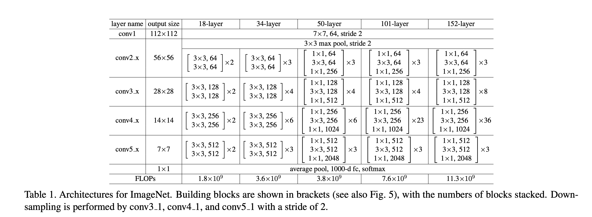

## ImageNet classification

Trains a ResNet50 model (He *et al.*, 2015) for the ImageNet classification task
(Russakovsky *et al.*, 2015). This model supports optional quantization of
weights and activation functions.



This example uses linear learning rate warmup and cosine learning rate schedule.

### Requirements
* TensorFlow dataset `imagenet2012:5.*.*`
* `≈180GB` of RAM if you want to cache the dataset in memory for faster IO
* Install package `dacite`. 

### Supported setups

The model can run on GPUs and TPUs, and should run with other configurations and
hardware. The following are test cases running on GPUs.

| Hardware | Batch size | Training time | Top-1 accuracy  | TensorBoard.dev |
| --- | --- | --- | --- | --- |
| 8 x Nvidia V100 (16GB)  | 512  |  13h 25m  | 76.63% | [2020-03-12](https://tensorboard.dev/experiment/jrvtbnlETgai0joLBXhASw/) |
| 8 x Nvidia V100 (16GB), mixed precision  | 2048  | 6h 4m | 76.39% | [2020-03-11](https://tensorboard.dev/experiment/F5rM1GGQRpKNX207i30qGQ/) |

### Acceptable quantization options

Currently, all Matmul layers (all `Conv` layers and the `Dense` layer) have
quantization support.

The main method to input quantization options is through a JSON config file,
which is passed through the flag `base_config_filename`.

If `base_config_filename` is not passed to the code, i.e. `None`, the
hyperparameters can be generated from helper methods in `hparams_gen.py`. The
function `generate_common_configs()` can generate hyperparameters from the flags
defined therein. `quant_target` indicates which parts of the model are to be
quantized and can accept an argument from one of the following values.

- NONE: No quantization; default.
- WEIGHTS_ONLY:	Weights are quantized only.
- WEIGHTS_AND_FIXED_ACTS:	Weights and activations are quantized; no automatic GetBounds.
- WEIGHTS_AND_AUTO_ACTS: Weights and activations are quantized; with automatic GetBounds.

Example launch:
```
python3 train.py --model_dir /tmp/resnet50_imagenet_w1_a_auto --hparams_config_dict configs/resnet50_w4_a4_auto.py
```
